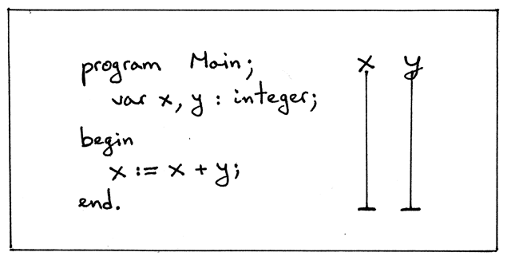

# 构建一个简单的解释器-Nested Scopes and a Source-to-Source Compiler.

## Scopes and scoped symbol tables
### 什么是 scope (范围或者作用域)?
范围是程序的文本区域，可以在其中使用名称。，例如:

    program Main;
      var x, y: integer;
    begin
      x := x + y;
    end.

可以看到这里的文本区域从关键字 program开始 到 end.结束。它只有一个作用域就是全局作用域，其中的 x,y在整个program里面都是可见的。  
当我们在讨论变量的作用域的时候实际上是在讨论它的声明作用域
  

在上图中，竖线显示了声明变量的范围，即可以使用声明名称x和y的文本区域，也就是它们可见的文本区域。x和y的范围是整个程序，如垂直线所示。
在Pascal语言中，像program和end这样的词汇关键词划分了作用域的文本边界；因为你从源代码你就能看出作用域的范围，不需要运行程序。所以这种也被称为 词法作用域或者静态作用域；
### 作用域有什么用？
* 每一个作用域都会创建一个独立的命名空间。这意味着一个变量声明不能被外层作用域使用
* 可以在不同的作用域里声明相同名字的变量，并且可以直接通过观看程序的源代码就能知道每个作用域里可用引用的变量范围；
* 在嵌套作用域中，可以使用与外部作用域相同的名称重新声明变量，从而有效地隐藏外部声明，从而控制对外部作用域中不同变量的访问。

### ScopedSymbolTable
首先我们需要更新一下我们得SymboleTable,新增一个 scope_name 和scope_level，分别代表作用域名和作用域层级；

    class ScopedSymbolTable {
    constructor(scopeName,scopeLevel) {
      this.scopeName = scopeName;
      this.scopeLevel = scopeLevel;
      this._symbols = {};
      this._initBuitinType();
    }

    _initBuitinType() {
      this.defineSymbol(new BuiltinTypeSymbol('INTEGER'));
      this.defineSymbol(new BuiltinTypeSymbol('REAL'));
    }

    defineSymbol(obj) {
      this._symbols[obj.name] = obj;
    }

    lookup(name) {
      return this._symbols[name];
    }
  }

### 带有形式参数的过程声明

    program Main;
      var x, y: real;

      procedure Alpha(a : integer);
          var y : integer;
      begin
          x := a + x + y;
      end;

    begin { Main }

    end.  { Main }

首先我们需要支持带参数得调用 procedure

    

